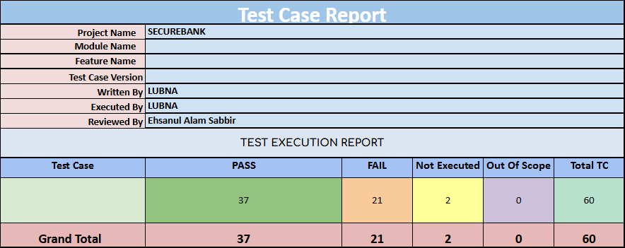
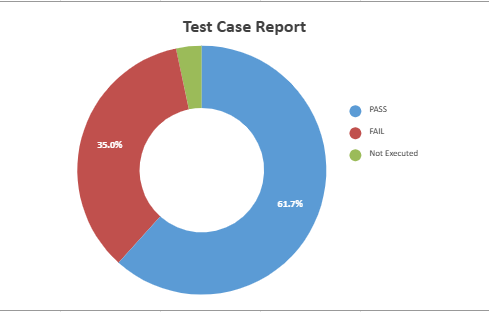

# Secure-Bank-Manual-Testing
## Overview
This document provides an overview of the manual testing process for the SecureBank website. It includes details on the test plan, scenarios, cases, and reports. Additionally, screenshots are included for reference.

## Contents
- Mind Map
- Test Plan
- Test Scenarios
- Test Cases
- Test Report
- Screenshots

## Mind Map
The mind map visually represents the key testing areas of SecureBank, covering authentication, navigation, transactions, and store functionalities.

## Test Plan
The test plan outlines the scope, objectives, testing approach, and tools used. It ensures that SecureBank functions correctly and meets requirements.

### Scope
- Testing the website's header, footer, authentication, and dashboard features.
- Verifying transactions, store purchases, and search functionalities.

### Objectives
- Ensure the website's core features function as expected.
- Identify and document defects for resolution.
- Validate navigation and usability.

### Testing Approach
- **Functional Testing:** Verify each feature operates correctly.
- **UI/UX Testing:** Check layout, responsiveness, and user experience.
- **Negative Testing:** Test incorrect inputs and unexpected user behavior.

## Test Scenarios
Defined scenarios for testing various components, including:
1. Authentication (Login, Sign-Up, Logout)
2. Navigation (Header, Footer, Dashboard Pages)
3. Transactions (View, Create, Upload)
4. Store (Purchased Services, History)
5. Search Functionality

## Test Cases
Detailed test cases are documented in the Excel file, covering inputs, expected outputs, and actual results.

## Test Report
Summarizes testing outcomes, including:
- Passed/Failed test cases
- Bugs and issues found
- Fixes and retests
- 

